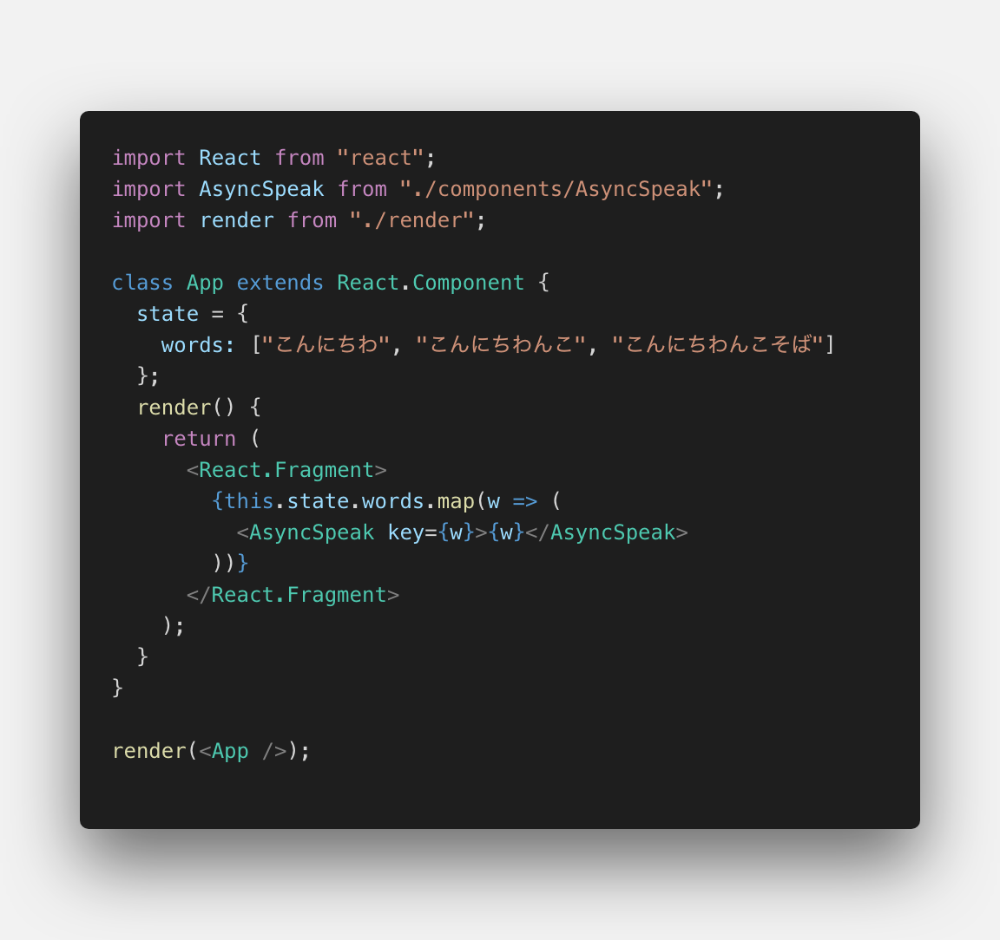
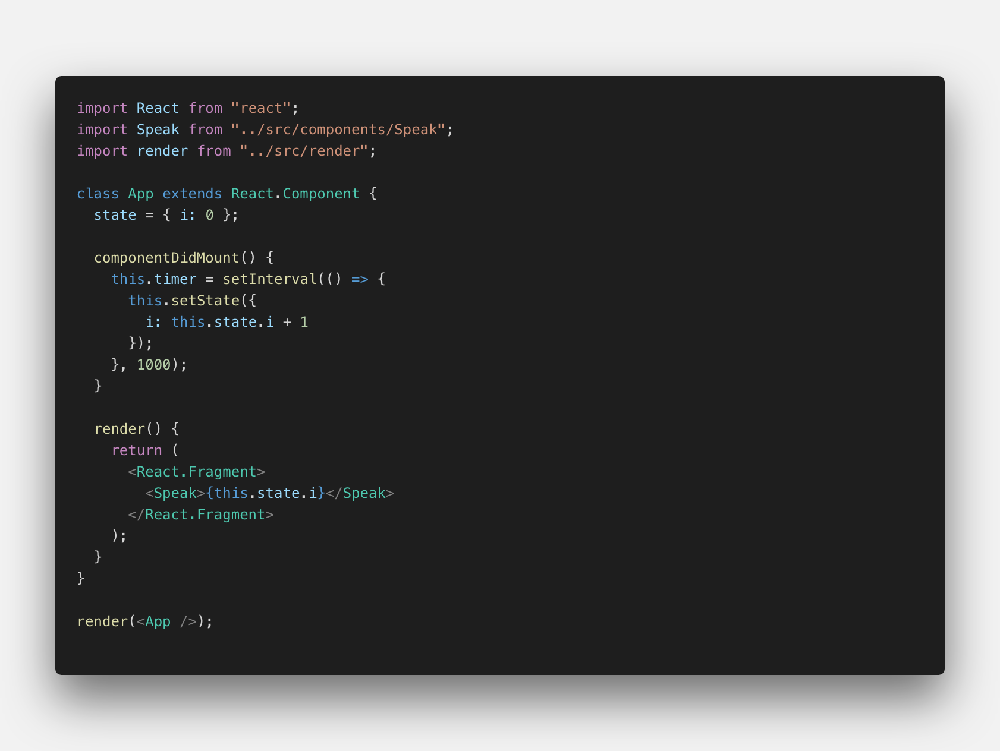

# react-voice

React for Voice User Interface

`$ git clone https://github.com/hand-dot/react-voice.git`  
`$ cd react-voice`  
`$ npm i`  
`$ npm run ex`  

## components
- Speak
- AsyncSpeak

## examples

- simple(src/index.js)

- updatestate(examples/updatestate.js)

## TODO

- [ ] Lesson component
- [ ] Question component
- [ ] Packaging for npm